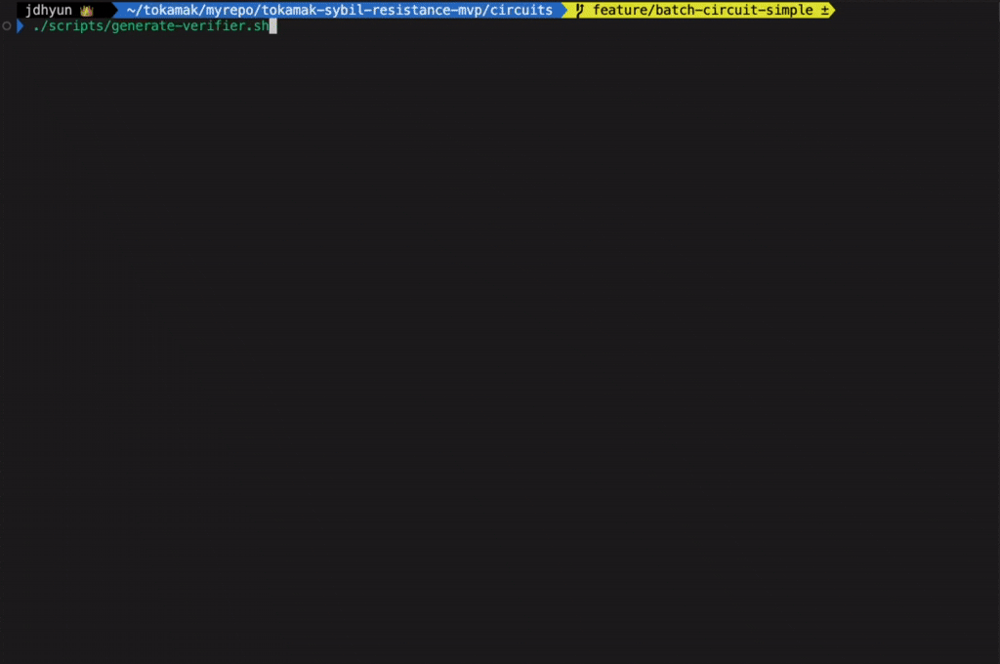

  <h1 align="center">
    Tokamak-Sybil-Resistance MVP Circuits
  </h1>
  
All circuits related to Tokamak-sybil-resistance are managed in this folder.

WIP: Will use [circomkit](https://github.com/erhant/circomkit) tools.

# Install
`npm install` to install dependencies

# Usage

## Verifier Contract Generation

To generate a Solidity verifier contract for your circuits, follow these steps:

1. Install dependencies:
~~~bash
npm install
~~~

2. Generate the verifier contract:
~~~bash
npm run verifier
~~~

This will create a `verifier.sol` file containing the Solidity smart contract that can verify proofs generated by your circuits.

### Example

