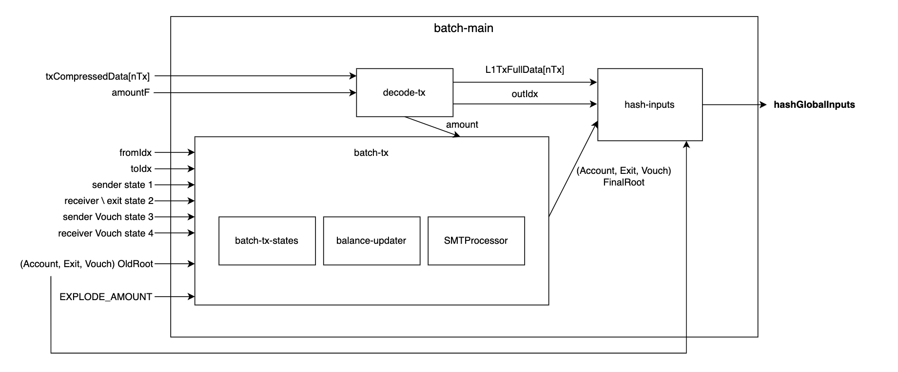

# Batch Circuit (for MVP)

The circuit verifies that the state transition from batch processing is valid by checking transaction execution correctness and state updates.

## Overview



This is a flow chart that mentions only the key elements. To check the actual details, refer to [the circuit code](https://github.com/tokamak-network/tokamak-sybil-resistance-mvp/tree/feature/batch-circuit/circuits/circuits/syb_rollup).

> ### 📌 Sequencer <> Batch Circuit
>The only circuit that the sequencer interacts with is [batch-main](https://www.notion.so/Batch-Circuit-for-MVP-9f46a986ba804811a7c7efcffce72f91?pvs=21). All other sub-circuits (e.g., `decode-tx`, `batch-tx`) are invoked *inside `batch-main`*; the Sequencer doesn’t interact with them separately.

>### 📌 SmartContract <> Batch Circuit
>In the contract, `hashGlobalInputs` must be directly calculated and passed as a parameter along with "the proof" of the `batch-main` to `Verifier.sol` (which will later be automatically generated via [snarkjs](https://github.com/iden3/snarkjs?tab=readme-ov-file)).
> <br>+<br> Since `EXPLODE_AMOUNT` has been changed to an input signal, it could pose vulnerabilities if it is a private input. To address this, it is processed as a public signal, and the value set in the contract is fetched directly in the verify function for verification.
><br><br> **Conclusion**:
>```solidity
>onchainVerify(EXPLODE_AMOUNT, hashGlobalInputs, Proof)
>```
>- **`EXPLODE_AMOUNT`**: A value stored in the contract's state.
>- **`hashGlobalInputs`**: The value directly calculated by the contract.
>- **`Proof`**: Generated (off-chain) by the Sequencer through `snarkjs`.

---

### 1. Main Purpose ([batch-main](https://www.notion.so/Batch-Circuit-for-MVP-9f46a986ba804811a7c7efcffce72f91?pvs=21))

The `BatchMain` circuit processes a batch of transactions (`nTx` of them) in a single proof. It starts with certain global inputs (like `oldLastIdx`, `oldAccountRoot`, `oldVouchRoot`) and ultimately outputs one public hash representing the validity of the entire batch.

### 2. Decoding Transactions ([decode-tx](https://www.notion.so/Batch-Circuit-for-MVP-9f46a986ba804811a7c7efcffce72f91?pvs=21))

For each transaction, a `decode-tx` component unpacks the compressed transaction data (`txCompressedData`) into more explicit fields (`fromIdx`, `toIdx`, `amount`, etc.). It also generates `L1TxFullData`, a bit-array later included in the final hash.

### 3. Processing Transactions ([batch-tx](https://www.notion.so/Batch-Circuit-for-MVP-9f46a986ba804811a7c7efcffce72f91?pvs=21))

Next, `batch-tx` takes these decoded fields and applies them to the system state, invoking sub-circuits:

- **`batch-tx-states`**: Identifies the [transaction type](https://www.notion.so/Batch-Circuit-for-MVP-9f46a986ba804811a7c7efcffce72f91?pvs=21) (transfer, exit, vouch, etc.) and sets the corresponding Merkle operations (INSERT, UPDATE, or nop).
- **`balance-updater`**: Adjusts the sender’s and receiver’s balances, including any deposit amounts and nullification if necessary.
- Multiple **`SMTProcessor`** instances: Update the Account, Exit, and Vouch trees, producing new roots after each transaction.

### 4. Chaining Roots & Final Hash ([hash-inputs](https://www.notion.so/Batch-Circuit-for-MVP-9f46a986ba804811a7c7efcffce72f91?pvs=21))

Each transaction’s new roots become the old roots for the subsequent transaction. Finally, a `HashInputs` sub-circuit aggregates (1) initial and final roots, (2) last index values, and (3) all `L1TxFullData` bit-arrays into a single hash: `hashGlobalInputs`. The entire batch can be efficiently verified on-chain using only a single public hash and the proof.