## Foundry

**Foundry is a blazing fast, portable and modular toolkit for Ethereum application development written in Rust.**

Foundry consists of:

-   **Forge**: Ethereum testing framework (like Truffle, Hardhat and DappTools).
-   **Cast**: Swiss army knife for interacting with EVM smart contracts, sending transactions and getting chain data.
-   **Anvil**: Local Ethereum node, akin to Ganache, Hardhat Network.
-   **Chisel**: Fast, utilitarian, and verbose solidity REPL.

## Documentation

https://book.getfoundry.sh/

## Usage

### Build

```shell
$ forge build
```

### Test

```shell
$ forge test
```

### Format

```shell
$ forge fmt
```

### Gas Snapshots

```shell
$ forge snapshot
```

### Anvil

```shell
$ anvil
```

### Deploy

```shell
$ forge script script/Counter.s.sol:CounterScript --rpc-url <your_rpc_url> --private-key <your_private_key>
```

### Cast

```shell
$ cast <subcommand>
```

### Help

```shell
$ forge --help
$ anvil --help
$ cast --help
```

# Poseidon Contracts (Thanos)
Poseidon2Elements deployed at: 0xb84B26659fBEe08f36A2af5EF73671d66DDf83db
Poseidon3Elements deployed at: 0xFc50367cf2bA87627f99EDD8703FF49252473AED
Poseidon4Elements deployed at: 0xF8AB2781AA06A1c3eF41Bd379Ec1681a70A148e0

# Deploy Poseidon
```forge script script/DeployPoseidon.s.sol --broadcast --ffi```

# Deploy Sybil
```forge script script/DeployVerifier.s.sol --rpc-url https://rpc.thanos-sepolia.tokamak.network --private-key <your_private_key> --broadcast```


```forge script script/DeploySybil.s.sol --rpc-url https://rpc.thanos-sepolia.tokamak.network --private-key <your_private_key> --broadcast```

# Generate .go file from the Sybil contract
Navigate to the contracts folder inside the tokamak-sybil-resistance-mvp directory.

Before running the script, you need to install `abigen`. Please [Follow the instructions here](https://geth.ethereum.org/docs/getting-started/installing-geth).

Run the following command:

```shell
sh sybil_go.sh
```

This will generate the `sybil.go` file in the `../sequencer/eth/contracts` folder.

# Snapshot Service Integration

This section provides a comprehensive guide for integrating the Sybil contract with Snapshot's governance platform. snapshot-testnet link: https://testnet.snapshot.box/#/
## Overview

The Sybil contract can be integrated with Snapshot to create a governance system where voting power is determined by sybil resistance scores rather than token holdings. This integration enables communities to conduct governance with greater protection against sybil attacks.
## Prerequisites

Before proceeding with the integration, ensure you have:
- A deployed Sybil contract on Sepolia testnet
- An ENS domain registered on Sepolia (available at [sepolia.app.ens.domains](https://sepolia.app.ens.domains/))
- Access to the contract address and ABI

## Step-by-Step Integration Guide

### 1. Accessing Snapshot Testnet

Navigate to the Snapshot testnet platform at [testnet.snapshot.box](https://testnet.snapshot.box/#/explore).

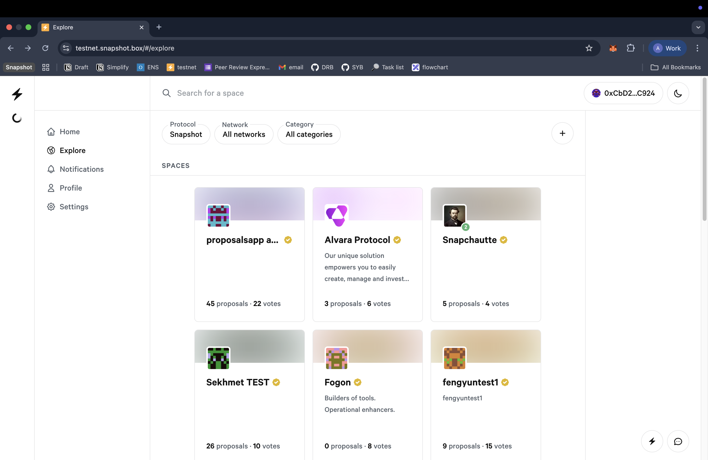

### 2. Creating a New Space

1. Click the plus (+) icon in the top-right corner to initiate space creation.

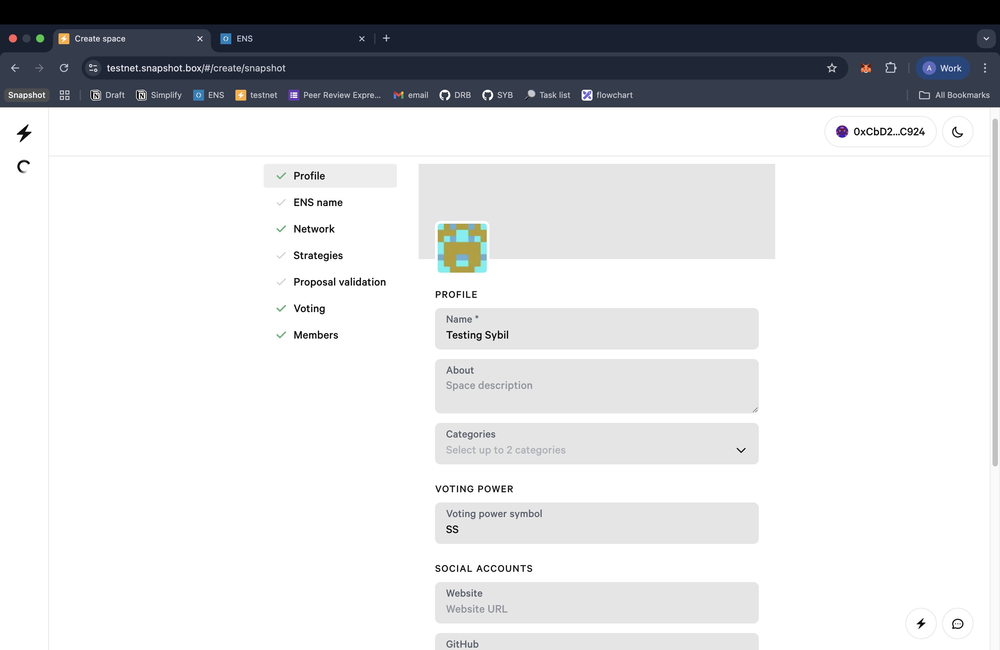

2. Complete the space configuration form with the following details:
   - **Space Name**: Your governance space identifier
   - **ENS Domain**: Your registered Sepolia ENS domain
   - **Description**: Detailed description of your governance space
   - **Additional metadata**: Logo, website, and social links as applicable

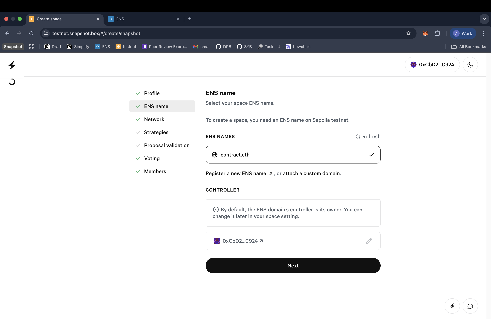

### 3. Network Configuration

Select **Sepolia Testnet** as the target network for your governance space.

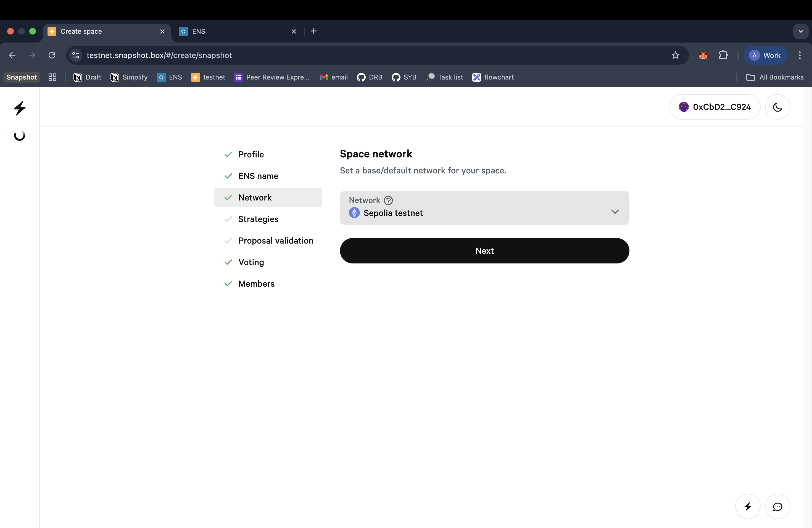

### 4. Strategy Configuration

Configure the voting strategy to integrate with your Sybil contract:

1. In the **Strategies** section, click **Add Strategy**.
2. Select **contract-call** as the strategy type.

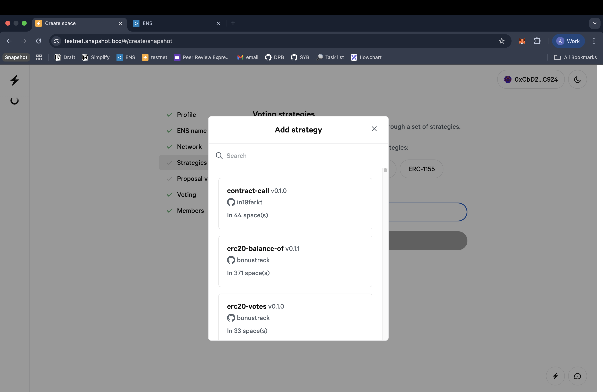

3. Configure the strategy parameters with the following JSON structure:

```json
{
  "address": "0x8F7AB8C5A57D5429B409D3515e2D847dE3f1986D",
  "decimals": 0,
  "methodABI": {
    "name": "getScore",
    "type": "function",
    "inputs": [
      {
        "name": "user",
        "type": "address",
        "internalType": "address"
      }
    ],
    "outputs": [
      {
        "name": "score",
        "type": "uint32",
        "internalType": "uint32"
      }
    ],
    "stateMutability": "view"
  }
}
```

**Note**: Replace the address field with your deployed Sybil contract address.

### 5. Proposal Validation Setup

Configure proposal validation requirements:

1. Select **Basic** validation method
2. Set the minimum score threshold to **1**
3. Additional validation methods can be configured post-deployment as needed

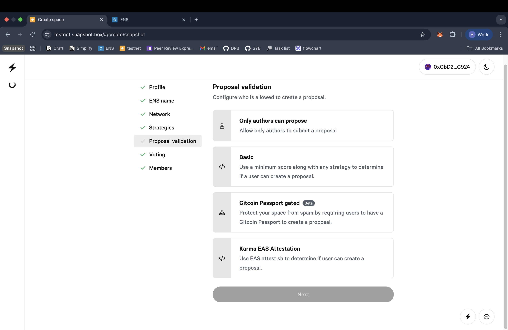

### 6. Voting Configuration

Set the voting parameters:

1. **Voting Period**: 5 minutes (adjustable based on governance requirements)
2. **Voting System**: Basic Voting (single choice)

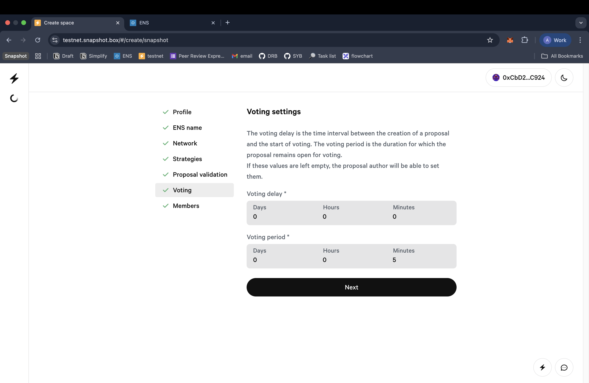

### 7. Members Management

Add governance participants:

1. Navigate to the **Members** section
2. Add authorized addresses that can create proposals
3. Configure member roles and permissions as required

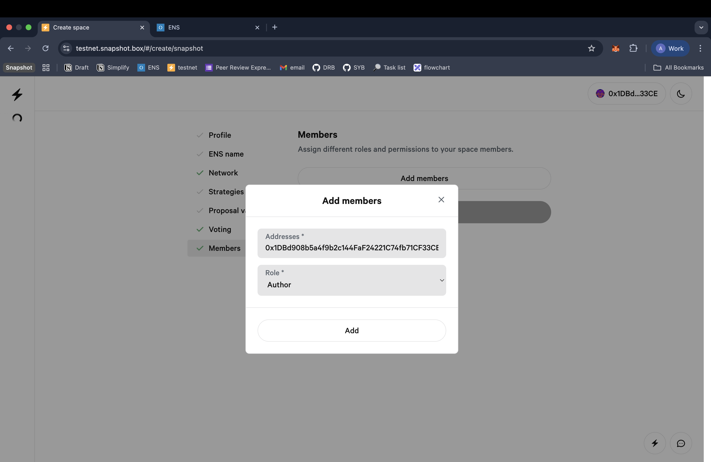

### 8. Space Deployment

Complete the space creation by clicking **Create Space**. This action will trigger an on-chain transaction that must be confirmed.

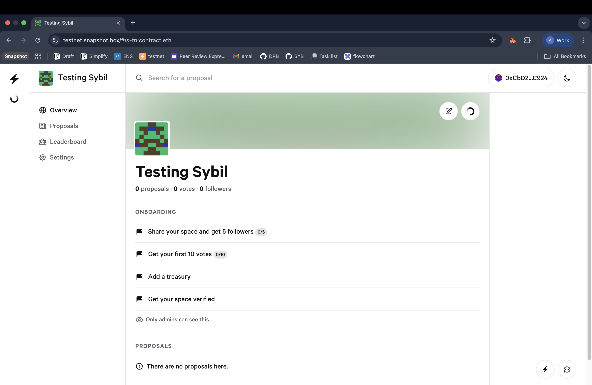

## Creating and Managing Proposals

### Proposal Creation

1. Navigate to the **Proposals** section in the top navigation
2. Click the proposal creation icon
3. **Authorization**: Only space owners and designated members can create proposals

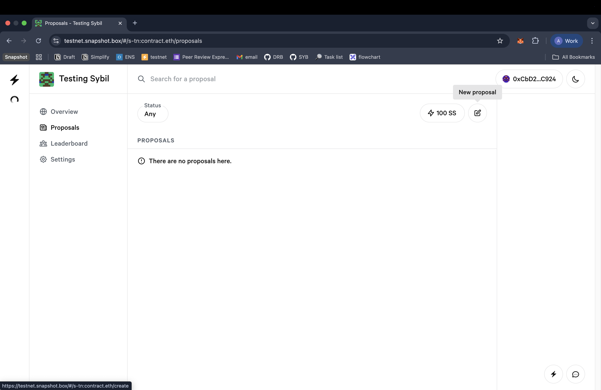

### Proposal Configuration

Configure your proposal with the following information:

1. **Title**: Clear, descriptive proposal title
2. **Description**: Comprehensive proposal details and rationale
3. **Voting System**: Select appropriate voting mechanism (Basic Voting recommended for initial setup)
4. **Publication**: Click **Publish** to deploy the proposal (requires on-chain transaction)

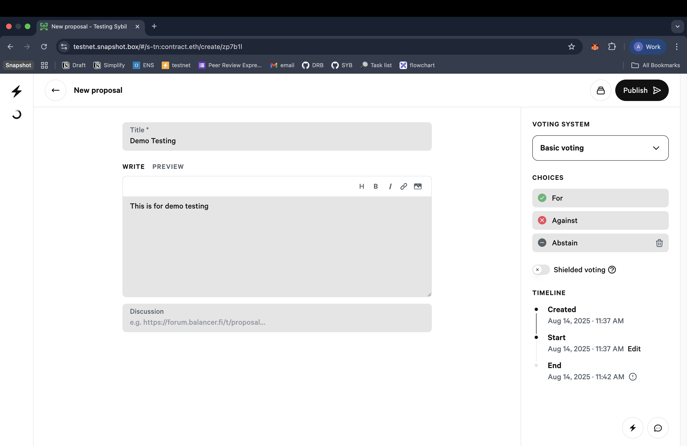

### Voting Process

Eligible participants can vote on active proposals:

1. **Eligibility**: Voters must have a sybil resistance score meeting the minimum threshold (≥1 in this configuration)
2. **Duration**: Voting remains active for the configured period (5 minutes in this example)
3. **Confirmation**: Click **Confirm** to submit your vote

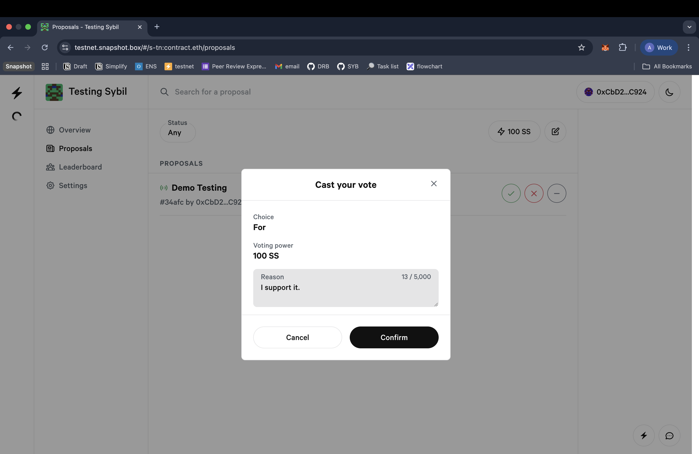

## Conclusion

This integration demonstrates how the Sybil contract can enhance decentralized governance by providing sybil-resistant voting mechanisms. 

For additional configuration options and advanced features, refer to the [Snapshot documentation](https://docs.snapshot.org/).